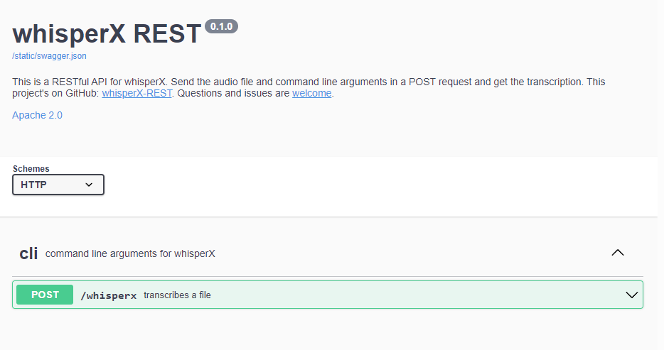

# whisperX-REST
The simplest yet fully functional RESTful API for [whisperX](https://github.com/m-bain/whisperX).

## Requirements

* All the requirements for [whisperX](https://github.com/m-bain/whisperX).
* 100+ GiB disk space.

##  Download

```bash
git clone https://github.com/AlekseiPrishchepo/whisperX-REST.git && cd whisperX-REST
```

## Install

Due to dependencies building container will take time and space. You may need to repeat if failed.

```bash
docker build -t whisperx-rest .
```

## Run

Deploy will take time. Don't kill it.

```bash
docker run -idt -p 5001:5001 --gpus all --name whisperx_rest whisperx-rest
```

## Use

First launch will trigger the download of additional files, which will slow down the result. If you get an error, try setting ``compute_type`` parameter to ``int8``.

API returns result in a single output format, so you need to set ``output_format`` argument to ``json``, ``srt``, ``tsv``, ``txt``, or ``vtt`` instead of default ``all``.

If you choose ``model`` other than ``small`` (the default), the new model will be downloaded and stored in the container.

Note that large models are demanding on GPU memory. You may want to adjust ``batch_size`` and ``compute_type`` parameters.

### Swagger

Try Swagger UI in browser at ``http://127.0.0.1:5001/api/docs/``.

</br>


### Curl
Send audio in POST request:

```bash
curl -s -X POST "http://127.0.0.1:5001/whisperx?output_format=txt" -F "audio=@sample/CNVSample227.wav"
```

Pass command line parameters for ``whisperx`` in the query string like that:

```bash
curl -s -X POST "http://127.0.0.1:5001/whisperx?model=medium&batch_size=4&fp16=False&compute_type=int8&language=en&output_format=json" -F "audio=@sample/CNVSample227.wav"
```

## Finally

Obviously it's not for production use. Do not expose it to public networks.
